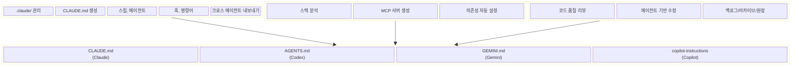
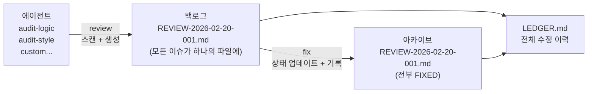
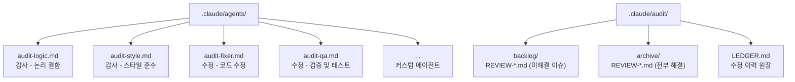
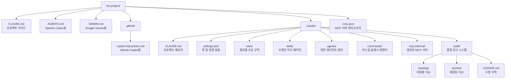

<div align="center">

# Claude Code Blueprint

**모든 AI 코딩 에이전트에게 프로젝트 컨텍스트를 자동으로 제공합니다.**

[](https://github.com/Jeonhui/claude-code-blueprint)
[](./LICENSE)
[](https://modelcontextprotocol.io/)

[빠른 시작](#빠른-시작) · [blueprint](#blueprint) · [blueprint-mcp](#blueprint-mcp) · [blueprint-audit](#blueprint-audit) · [프로젝트 구조](#프로젝트-구조)

[English](./README.md)

</div>

## Claude Code Blueprint란?

AI 코딩 에이전트(Claude Code, GitHub Copilot, OpenAI Codex, Google Gemini)는 프로젝트의 컨벤션, 아키텍처, 기술 스택, 도구를 깊이 이해할 때 가장 잘 작동합니다. 하지만 이 컨텍스트를 수동으로 관리하는 것은 번거롭고 오류가 발생하기 쉬우며, 에이전트마다 반복해야 합니다.

**Claude Code Blueprint (CCB)** 은 AI 컨텍스트를 인프라로 취급합니다. 한 번의 명령으로 프로젝트를 스캔하고 AI 에이전트가 효과적으로 작업하는 데 필요한 모든 것을 생성합니다 — 하나의 `.claude/` 디렉토리에서 관리됩니다.

### CCB만의 차별점

- **마크다운 네이티브** — DB도, 빌드도 필요 없음. 모든 설정이 순수 마크다운 — 읽기, diff, 버전 관리 가능.
- **한 번 작성, 모든 에이전트에서 실행** — `.claude/`에 한 번 정의하고 Claude, Codex, Gemini, Copilot으로 한 명령어로 내보내기.
- **조합 가능한 지식** — 스킬, 규칙, 에이전트, 명령어, 훅이 독립 블록. 자유롭게 조합, 교체 가능.
- **역할 명세 프로토콜** — 감사 명령은 범용 실행기. 에이전트 파일 교체 → 동작 전체 변경.
- **제로 침투** — 모든 것이 `.claude/` 안에. 폴더 삭제로 완전 복원. 소스 코드 무변경.
- **자동 감지 + 수동 오버라이드** — 기술 스택 자동 스캔, 생성된 파일은 언제든 수동 편집 가능.



---

## 핵심 개념

CCB는 AI 컨텍스트를 `.claude/` 안의 조합 가능한 빌딩 블록으로 구성합니다:

| 개념 | 위치 | 설명 |
|:---|:---|:---|
| **스킬** | `.claude/skills/` | 도메인 지식 패키지 — 재사용 가능한 컨벤션과 모범 사례 모음 (예: REST API 설계, 엄격한 TypeScript 규칙) |
| **규칙** | `.claude/rules/` | 경로별 코딩 표준 — 에이전트가 해당 파일 작업 시 자동 적용 |
| **에이전트** | `.claude/agents/` | 전문 역할 정의 — YAML 프론트매터 + 마크다운 본문으로 에이전트의 초점과 동작 방식을 정의 |
| **명령어** | `.claude/commands/` | 커스텀 슬래시 명령어 — `/command-name`으로 호출 가능한 프롬프트 템플릿 |
| **훅** | `.claude/settings.json` | 이벤트 기반 셸 명령어 — 도구 사용 이벤트(PreToolUse, PostToolUse 등)에 트리거 |
| **MCP 서버** | `.claude/mcp-internal/` | 프로젝트 전용 Model Context Protocol 서버 — 기술 스택에서 자동 생성 |

이 빌딩 블록들은 독립적이며 조합 가능합니다. 필요한 것만 설치하고, 자유롭게 커스터마이징하며, 다른 AI 에이전트로 내보낼 수 있습니다.

### 세 플러그인, 하나의 시스템

| 플러그인 | 역할 | 사용 시점 |
|:---|:---|:---|
| **blueprint** | 환경 관리 | 항상 — `.claude/` 설정과 모든 구성을 관리하는 핵심 플러그인 |
| **blueprint-mcp** | MCP 서버 생성 | 프레임워크와 데이터베이스에 맞춤화된 MCP 서버를 자동 생성하고 싶을 때 |
| **blueprint-audit** | 품질 감사 | 에이전트 기반 코드 리뷰와 구조화된 이슈 추적, 자율 수정이 필요할 때 |

각 플러그인은 독립적으로 설치되며 단독으로 작동하지만, 동일한 `.claude/` 디렉토리를 공유하고 서로 보완합니다.

---

## 요구사항

- [Claude Code](https://docs.anthropic.com/en/docs/claude-code) CLI 설치 및 인증 완료
- 플러그인 지원 활성화 (Claude Code v1.0+)

---

## 빠른 시작

```bash
# 1. 플러그인 설치
/plugin marketplace add Jeonhui/claude-code-blueprint

/plugin install blueprint@claude-code-blueprint
/plugin install blueprint-mcp@claude-code-blueprint
/plugin install blueprint-audit@claude-code-blueprint

# 2. 프로젝트 초기화
/blueprint:init
/blueprint:claudemd-generate
/blueprint:export --target all

# 3. 첫 감사 실행
/blueprint-audit:review
/blueprint-audit:status
/blueprint-audit:fix --next
```

---

## blueprint

> 핵심 환경 관리자 — `.claude/` 초기화, 프로젝트 컨텍스트 생성, Claude Code 설정 전반을 관리합니다.

blueprint 플러그인은 CCB의 기반입니다. 코드베이스를 분석하여 프로젝트의 기술 스택, 디렉토리 구조, 코딩 컨벤션, 사용 가능한 스크립트를 캡처하는 종합적인 `CLAUDE.md`를 생성합니다. 또한 스킬, 에이전트, 명령어, 훅, 크로스 에이전트 내보내기를 위한 전체 관리 레이어를 제공하여 간단한 슬래시 명령어로 맞춤형 AI 개발 환경을 구축할 수 있습니다.

### 설정 및 진단

| 명령어 | 설명 |
|:---|:---|
| `/blueprint:init` | `.claude/` 디렉토리 구조 생성 — 기존 파일 덮어쓰지 않음 |
| `/blueprint:status` | 메모리 레이어, MCP, 스킬, 에이전트, 규칙 현황 보고 |
| `/blueprint:claudemd-generate` | 기술 스택, 명령어, 컨벤션 포함 `CLAUDE.md` 생성 |
| `/blueprint:doctor` | `.claude/` 무결성 진단, 경로 검증, 자동 수정 |

### 콘텐츠 관리

| 명령어 | 설명 |
|:---|:---|
| `/blueprint:skill-add` | 내장 스킬 설치 (도메인 지식 패키지) |
| `/blueprint:skill-list` | 설치/사용 가능한 스킬 목록 |
| `/blueprint:agent-add` | 내장 에이전트 템플릿 설치 |
| `/blueprint:agent-list` | 설치/사용 가능한 에이전트 목록 |
| `/blueprint:agent-create` | 커스텀 에이전트 생성 (모델, 도구, 프롬프트) |
| `/blueprint:agent-scaffold` | Anthropic Agent SDK 프로젝트 스캐폴딩 |
| `/blueprint:hook-add` | 이벤트 기반 훅 추가 |
| `/blueprint:hook-list` | 설정된 훅 목록 |
| `/blueprint:command-add` | 커스텀 슬래시 명령어 생성 |
| `/blueprint:command-list` | 커스텀 명령어 목록 |

### 크로스 에이전트 내보내기 및 MCP

| 명령어 | 설명 |
|:---|:---|
| `/blueprint:inject-directive` | `.claude/` 인덱스를 루트 `CLAUDE.md`에 주입 |
| `/blueprint:export` | Codex, Gemini, Copilot용 가이드 파일 생성 |
| `/blueprint:tool-generate` | MCP 서버 템플릿 생성 |
| `/blueprint:tool-link` | `.mcp.json`에 MCP 서버 등록 |

<details>
<summary><b>내장 스킬</b></summary>
<br>

| 이름 | 설명 |
|:---|:---|
| `rest-api-guide` | REST 컨벤션 — HTTP 메서드, 상태 코드, URL 네이밍, 페이지네이션, 에러 포맷 |
| `test-convention` | 테스트 모범 사례 — AAA 패턴, 네이밍 규칙, 모킹 전략 |
| `typescript-strict` | 엄격한 TypeScript — `any` 금지, 판별 유니온, Result 타입 |
| `git-workflow` | Git 컨벤션 — Conventional Commits, 브랜치 전략, PR 가이드라인 |

</details>

<details>
<summary><b>내장 에이전트</b></summary>
<br>

| 이름 | 모델 | 도구 | 역할 |
|:---|:---:|:---|:---|
| `code-reviewer` | sonnet | Read, Glob, Grep | 심각도별 코드 품질 분석 및 피드백 |
| `debugger` | sonnet | Read, Glob, Grep, Bash | 근본 원인 분석 기반 체계적 디버깅 |
| `test-engineer` | sonnet | Read, Glob, Grep, Bash, Write, Edit | 테스트 작성, 커버리지 분석, 불안정 테스트 수정 |
| `architect` | opus | Read, Glob, Grep | 아키텍처 트레이드오프 분석 및 추천 |
| `security-reviewer` | sonnet | Read, Glob, Grep, Bash | OWASP Top 10 감사, 시크릿 탐지, CVE 점검 |

</details>

---

## blueprint-mcp

> 프로젝트 기술 스택을 분석하고, 프레임워크/DB/API 패턴에 맞춤화된 MCP 서버를 생성합니다.

blueprint-mcp 플러그인은 `package.json`, 설정 파일, 소스 디렉토리 구조를 읽어 사용 중인 프레임워크, ORM, API 패턴, 인프라 도구를 식별합니다. 그런 다음 스택에 특화된 도구가 포함된 완전히 작동하는 MCP 서버를 생성합니다 — 예를 들어 Prisma 스키마 조회, Next.js 라우트 목록, GraphQL 쿼리 헬퍼 등입니다. 생성된 서버는 `.claude/mcp-internal/`에 배치되고 `.mcp.json`에 자동 등록됩니다.

| 명령어 | 설명 |
|:---|:---|
| `/blueprint-mcp:analyze` | 프레임워크, DB, API 패턴, 디렉토리 구조 감지 |
| `/blueprint-mcp:generate` | 기술 스택에 맞는 MCP 서버 전체 생성 |
| `/blueprint-mcp:setup` | 의존성 설치 및 `.mcp.json` 등록 |

<details>
<summary><b>감지 가능한 기술</b></summary>
<br>

| 카테고리 | 감지 대상 |
|:---|:---|
| **프레임워크** | Next.js, Express, NestJS, Fastify, React, Vue, Svelte, Hono, Remix, Vite, Jest, Vitest |
| **DB/ORM** | Prisma, TypeORM, Drizzle, Mongoose, Sequelize, Knex, Kysely |
| **API 패턴** | REST, GraphQL (Apollo, Yoga), tRPC, gRPC, WebSocket (Socket.IO, ws) |
| **스타일링** | Tailwind CSS, Emotion, styled-components |
| **인프라** | 모노레포 (workspaces, Turborepo, Nx, Lerna), 패키지 매니저 (npm, yarn, pnpm, bun) |

</details>

---

## blueprint-audit

> 마크다운 기반 품질 감사 프레임워크 — 전문 에이전트가 코드를 스캔하고, 구조화된 이슈를 생성하며, 자율적으로 수정합니다. 모든 활동은 백로그/아카이브/원장 시스템으로 추적됩니다.

blueprint-audit 플러그인은 프로젝트에 구조화된 코드 품질 관리를 제공합니다. 단일 린터나 리뷰 도구에 의존하는 대신, **역할 특화 에이전트** — 각각 고유한 초점 영역, 체크리스트, 심각도 기준을 가진 — 를 사용하여 코드를 스캔하고 실행 가능한 이슈를 생성합니다. 이슈는 전적으로 마크다운 파일로 추적되므로(외부 데이터베이스 불필요) 읽기, diff, 버전 관리가 쉽습니다. 수정 에이전트가 이슈를 자율적으로 수정하며, 모든 변경 사항이 원장에 기록되어 완전한 추적성을 보장합니다.

### 동작 방식



각 `review` 실행은 발견된 모든 이슈를 포함하는 **단일 통합 파일**을 생성합니다. 이슈는 상태를 직접 업데이트하여 수정됩니다. 리뷰 파일의 모든 이슈가 해결되면 파일이 아카이브로 이동합니다.

### 워크플로우 개요

```
1. REVIEW ──→ 2. STATUS ──→ 3. FIX ──→ 4. STATUS
   코드 스캔      대시보드      이슈       진행 상황
   이슈 생성      확인          수정       확인
```

**1단계 — 리뷰:** 감사 에이전트가 코드를 스캔하고 이슈를 생성합니다.
```bash
/blueprint-audit:review
```

**2단계 — 상태 확인:** 발견된 내용을 확인합니다.
```bash
/blueprint-audit:status
```

**3단계 — 수정:** 가장 높은 우선순위의 이슈를 수정합니다.
```bash
/blueprint-audit:fix --next
```

**4단계 — 반복** 모든 이슈가 해결될 때까지 반복합니다.

### 역할 명세 프로토콜

review와 fix는 **범용 실행기** — 모든 동작은 에이전트 역할 명세 파일이 결정합니다.

```yaml
# .claude/agents/audit-logic.md
---
name: audit-logic
type: auditor                    # "auditor"는 리뷰용, "optimizer"는 수정용
focus: "논리 결함, 경쟁 조건, null 참조"
scan_patterns:
  - "src/**/*.{ts,tsx,js,jsx}"
ignore_patterns:
  - "**/*.test.*"
---
# Review Checklist
- 무한 루프 또는 제한 없는 재귀
- 누락된 예외 처리 ...
```

- 에이전트 파일을 교체하면 review/fix 동작이 완전히 달라짐
- 커스텀 에이전트도 내장 에이전트와 동일하게 동작
- **이름 해석:** `-b logic`과 `-b audit-logic` 모두 `audit-logic.md`로 해석됨

### 명령어 레퍼런스

#### 리뷰

감사 에이전트로 프로젝트 파일을 스캔하고 백로그에 이슈를 생성합니다.

```bash
/blueprint-audit:review                    # 모든 감사 에이전트 실행
/blueprint-audit:review -b logic           # 특정 에이전트 (축약형)
/blueprint-audit:review -b audit-logic     # 특정 에이전트 (전체 이름)
/blueprint-audit:review -s "src/**/*.ts"   # 스캔 범위 제한
/blueprint-audit:review -p high            # high 이상만 보고
/blueprint-audit:review --dry-run          # 파일 생성 없이 미리보기
/blueprint-audit:review -b logic -s "src/**/*.ts" -p high --dry-run  # 조합
```

| 플래그 | 설명 |
|:---|:---|
| `-b, --by <agent>` | 특정 감사 에이전트 실행 |
| `-s, --scope <glob>` | 에이전트의 scan_patterns 대신 사용할 범위 |
| `-p, --priority <level>` | 최소 우선순위 필터 (`critical`, `high`, `medium`, `low`) |
| `--dry-run` | 백로그에 기록하지 않고 미리보기 |

#### 수정

수정 에이전트로 이슈를 해결하고 상태와 원장을 업데이트합니다.

```bash
/blueprint-audit:fix -i AUDIT-20260220-001    # ID로 수정
/blueprint-audit:fix --next                # 최고 우선순위 자동 선택
/blueprint-audit:fix --all                 # 모든 미해결 이슈를 우선순위 순서로 수정
/blueprint-audit:fix --next -v             # 수정 + QA 검증
/blueprint-audit:fix --next -b fixer       # 특정 수정 에이전트 사용
/blueprint-audit:fix -i AUDIT-20260220-003 --dry-run  # 수정 계획 미리보기
```

| 플래그 | 설명 |
|:---|:---|
| `-i, --id <id>` | 특정 이슈 ID로 수정 |
| `-n, --next` | 가장 높은 우선순위의 미해결 이슈 자동 선택 |
| `-a, --all` | 모든 미해결 이슈를 우선순위 순서로 순차 수정 |
| `-b, --by <agent>` | 사용할 수정 에이전트 (기본값: `audit-fixer`) |
| `-v, --verify` | 수정 후 `audit-qa`로 검증 실행 |
| `--dry-run` | 파일 수정 없이 변경 계획만 표시 |

#### 상태

품질 감사 대시보드를 표시합니다.

```bash
/blueprint-audit:status                    # 전체 대시보드
/blueprint-audit:status --brief            # 한 줄 요약
/blueprint-audit:status -b logic           # 에이전트별 필터
/blueprint-audit:status -p high            # 우선순위별 필터
```

#### 에이전트 관리

```bash
/blueprint-audit:agent-add -n security -t auditor        # 감사 에이전트 생성 → audit-security.md
/blueprint-audit:agent-add -n perf -t auditor --minimal  # 기본값으로 빠른 생성
/blueprint-audit:agent-add -n opt -t optimizer --from ./spec.md  # 파일에서 가져오기
/blueprint-audit:agent-add -n a11y -t auditor --custom   # 명세 본문 직접 작성
```

#### 인스트럭션 (크로스 에이전트용)

```bash
/blueprint-audit:review-instruction  # 감사 역할 명세 + 리뷰 명령어 출력
/blueprint-audit:fix-instruction     # 수정 역할 명세 + 수정 명령어 출력
```

다른 에이전트의 컨텍스트에 복사-붙여넣기하여 감사 기능을 부여할 수 있습니다.

<details>
<summary><b>기본 감사 에이전트</b></summary>
<br>

| 이름 | 유형 | 초점 |
|:---|:---:|:---|
| `audit-logic` | 감사 | 논리 결함, 무한 루프, 경쟁 조건, null 참조, 리소스 누수 |
| `audit-style` | 감사 | CLAUDE.md 준수, 네이밍 컨벤션, 포매팅, 임포트 정리 |
| `audit-fixer` | 수정 | 패턴 기반 코드 수정, 최소 변경, 모범 사례 적용 |
| `audit-qa` | 수정 | 수정 검증, 회귀 테스트, 수정 코드 테스트 생성 |

</details>

<details>
<summary><b>리뷰 파일 형식</b></summary>
<br>

각 리뷰 실행은 `.claude/audit/backlog/`에 하나의 통합 파일을 생성합니다:

```markdown
---
review_id: REVIEW-2026-02-20-001
date: 2026-02-20
agents: [audit-logic]
scope: "src/**/*.ts"
total_issues: 3
---

# Review: REVIEW-2026-02-20-001

| ID | Priority | Status | Reviewer | Target | Title |
|:---|:---|:---|:---|:---|:---|
| AUDIT-20260220-001 | high | TO_FIX | audit-logic | src/api/handler.ts:42 | 미처리 null 참조 |
| AUDIT-20260220-002 | medium | TO_FIX | audit-logic | src/utils/parse.ts:15 | 누락된 에러 처리 |
| AUDIT-20260220-003 | low | TO_FIX | audit-logic | src/config.ts:8 | 미사용 변수 |

---

## AUDIT-20260220-001: 요청 파서의 미처리 null 참조
- **status:** TO_FIX
- **reviewer:** audit-logic
- **priority:** high
- **target:** src/api/handler.ts:42

### Description
42행의 `parseBody()` 호출은 다음 경우에 null을 반환할 수 있습니다...

### Improvement Suggestion
`body.data`에 접근하기 전에 null 체크를 추가합니다...

---

## AUDIT-20260220-002: parse 유틸리티의 누락된 에러 처리
- **status:** TO_FIX
...
```

이슈가 수정되면 `status`가 `FIXED`로 변경됩니다. 파일 내 모든 이슈가 해결되면 `.claude/audit/archive/`로 이동합니다.

</details>

<details>
<summary><b>감사 디렉토리 구조</b></summary>
<br>



</details>

---

## 프로젝트 구조



> `.claude/`를 삭제하면 모든 것이 원상복구됩니다. CCB는 소스 코드를 절대 수정하지 않습니다.

---

## CCB 확장하기

CCB는 커스터마이징을 위해 설계되었습니다. 모든 구성 요소를 다른 요소에 영향 없이 추가, 수정, 제거할 수 있습니다.

**도메인 지식 추가** — 내장 스킬 설치 또는 `.claude/skills/`에 직접 생성:
```bash
/blueprint:skill-add rest-api-guide        # 내장 스킬 설치
/blueprint:skill-add typescript-strict     # 추가 설치
```

**전문 에이전트 생성** — 팀의 요구에 맞는 커스텀 에이전트 역할 정의:
```bash
/blueprint:agent-create                    # 대화형 에이전트 빌더
/blueprint:agent-scaffold                  # Anthropic Agent SDK 프로젝트 생성
```

**훅으로 워크플로우 자동화** — 도구 사용 이벤트에 셸 명령어 실행:
```bash
/blueprint:hook-add                        # pre/post 도구 사용 훅 추가
```

**프로젝트 전용 도구 구축** — 기술 스택에서 MCP 서버 생성:
```bash
/blueprint:tool-generate                   # MCP 서버 템플릿 생성
/blueprint:tool-link                       # .mcp.json에 등록
```

**다른 AI 에이전트와 컨텍스트 공유** — `.claude/` 지식을 내보내기:
```bash
/blueprint:export --target all             # AGENTS.md, GEMINI.md, copilot-instructions.md 생성
```

---

## 설계 원칙

| 원칙 | 설명 |
|:---|:---|
| **레거시 우선** | 기존 파일을 절대 덮어쓰지 않음 — 누락된 것만 추가 |
| **캡슐화** | 모든 것이 `.claude/` 안에 존재 — 폴더 삭제로 완전 복원 |
| **모듈형 인텔리전스** | 지식을 스킬, 규칙, 에이전트로 분리 — 필요 시 로드 |
| **역할 명세 프로토콜** | 감사 명령은 범용 실행기 — 모든 동작은 에이전트 역할 명세 파일이 정의 |
| **영역 보존** | 내보내기 시 마커 블록 사용 — 마커 외부 사용자 콘텐츠는 절대 변경하지 않음 |

## 라이선스

[MIT](./LICENSE)

---

<div align="center">

**Jeonhui Lee** — [@Jeonhui](https://github.com/Jeonhui)

</div>
