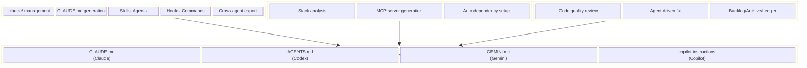
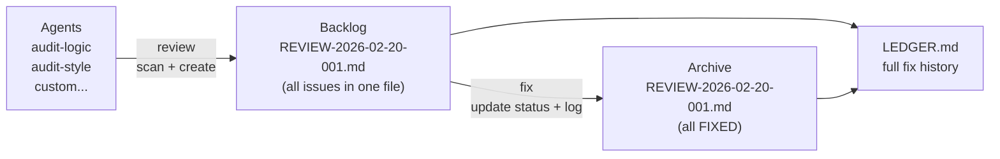
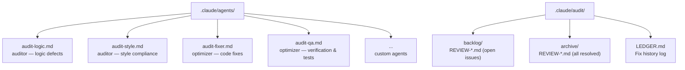
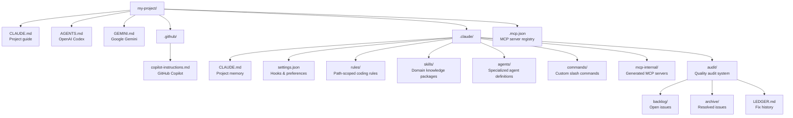

<div align="center">

# Claude Code Blueprint

**Give every AI coding agent full context about your project — automatically.**

[](https://github.com/Jeonhui/claude-code-blueprint)
[](./LICENSE)
[](https://modelcontextprotocol.io/)

[Quick Start](#quick-start) · [blueprint](#blueprint) · [blueprint-mcp](#blueprint-mcp) · [blueprint-audit](#blueprint-audit) · [Project Structure](#project-structure)

[한국어](./README.ko.md)

</div>

**Claude Code Blueprint (CCB)** scans your project, detects your tech stack, and generates the configuration files that AI coding agents need — `CLAUDE.md`, coding rules, agent definitions, hooks, commands, and cross-agent exports — all managed from a single `.claude/` directory.



---

## Quick Start

```bash
# 1. Install plugins
/plugin marketplace add Jeonhui/claude-code-blueprint

/plugin install blueprint@claude-code-blueprint
/plugin install blueprint-mcp@claude-code-blueprint
/plugin install blueprint-audit@claude-code-blueprint

# 2. Initialize project
/blueprint:init
/blueprint:claudemd-generate
/blueprint:export --target all

# 3. Run your first audit
/blueprint-audit:review
/blueprint-audit:status
/blueprint-audit:fix --next
```

---

## blueprint

> Core environment manager — initializes `.claude/`, generates project context, and manages all Claude Code configuration.

### Setup & Diagnostics

| Command | Description |
|:---|:---|
| `/blueprint:init` | Create `.claude/` directory structure — never overwrites existing files |
| `/blueprint:status` | Report memory layers, MCP servers, skills, agents, and rules |
| `/blueprint:claudemd-generate` | Generate `CLAUDE.md` with tech stack, commands, and conventions |
| `/blueprint:doctor` | Diagnose `.claude/` integrity, validate paths, auto-fix issues |

### Content Management

| Command | Description |
|:---|:---|
| `/blueprint:skill-add` | Install a built-in skill (domain knowledge package) |
| `/blueprint:skill-list` | List installed and available skills |
| `/blueprint:agent-add` | Install a built-in agent template |
| `/blueprint:agent-list` | List installed and available agents |
| `/blueprint:agent-create` | Create a custom agent with model, tools, and system prompt |
| `/blueprint:agent-scaffold` | Scaffold a standalone Anthropic Agent SDK project |
| `/blueprint:hook-add` | Add an event-driven hook (event + matcher + shell command) |
| `/blueprint:hook-list` | List all configured hooks |
| `/blueprint:command-add` | Create a custom slash command with a prompt template |
| `/blueprint:command-list` | List custom commands |

### Cross-Agent Export & MCP

| Command | Description |
|:---|:---|
| `/blueprint:inject-directive` | Inject `.claude/` index into root `CLAUDE.md` |
| `/blueprint:export` | Generate guide files for Codex, Gemini, and Copilot |
| `/blueprint:tool-generate` | Create an MCP server template in `.claude/mcp-internal/` |
| `/blueprint:tool-link` | Register internal MCP servers in `.mcp.json` |

<details>
<summary><b>Built-in Skills</b></summary>
<br>

| Name | Description |
|:---|:---|
| `rest-api-guide` | REST conventions — HTTP methods, status codes, URL naming, pagination, error formats |
| `test-convention` | Testing best practices — AAA pattern, naming rules, mocking strategies |
| `typescript-strict` | Strict TypeScript — no `any`, discriminated unions, Result types |
| `git-workflow` | Git conventions — Conventional Commits, branching strategy, PR guidelines |

</details>

<details>
<summary><b>Built-in Agents</b></summary>
<br>

| Name | Model | Tools | Role |
|:---|:---:|:---|:---|
| `code-reviewer` | sonnet | Read, Glob, Grep | Code quality analysis with severity-rated feedback |
| `debugger` | sonnet | Read, Glob, Grep, Bash | Systematic debugging with root cause analysis |
| `test-engineer` | sonnet | Read, Glob, Grep, Bash, Write, Edit | Test writing, coverage analysis, flaky test fixes |
| `architect` | opus | Read, Glob, Grep | Architecture trade-off analysis and recommendations |
| `security-reviewer` | sonnet | Read, Glob, Grep, Bash | OWASP Top 10 audit, secrets detection, CVE checks |

</details>

---

## blueprint-mcp

> Analyzes your project tech stack and generates a custom MCP server tailored to your frameworks, databases, and API patterns.

| Command | Description |
|:---|:---|
| `/blueprint-mcp:analyze` | Detect frameworks, databases, API patterns, and directory structure |
| `/blueprint-mcp:generate` | Generate a complete MCP server matching your stack |
| `/blueprint-mcp:setup` | Install dependencies and register in `.mcp.json` |

<details>
<summary><b>Detected Technologies</b></summary>
<br>

| Category | Detected |
|:---|:---|
| **Frameworks** | Next.js, Express, NestJS, Fastify, React, Vue, Svelte, Hono, Remix, Vite, Jest, Vitest |
| **Database/ORM** | Prisma, TypeORM, Drizzle, Mongoose, Sequelize, Knex, Kysely |
| **API Patterns** | REST, GraphQL (Apollo, Yoga), tRPC, gRPC, WebSocket (Socket.IO, ws) |
| **Styling** | Tailwind CSS, Emotion, styled-components |
| **Infrastructure** | Monorepo (workspaces, Turborepo, Nx, Lerna), Package manager (npm, yarn, pnpm, bun) |

</details>

---

## blueprint-audit

> Markdown-based quality audit framework — agent personas scan your code, create structured issues, and apply autonomous fixes, tracked in a human-readable backlog/archive/ledger system.

### How It Works



Each `review` run produces a **single consolidated file** containing all issues found. Issues are fixed in-place by updating their status. When all issues in a review file are resolved, the file moves to archive.

### Workflow Overview

```
1. REVIEW ──→ 2. STATUS ──→ 3. FIX ──→ 4. STATUS
   scan code     check        fix an      verify
   create        dashboard    issue       progress
   issues
```

**Step 1 — Review:** Auditor agents scan your code and create issues.
```bash
/blueprint-audit:review
```

**Step 2 — Check status:** See what was found.
```bash
/blueprint-audit:status
```

**Step 3 — Fix:** Apply a fix to the highest-priority issue.
```bash
/blueprint-audit:fix --next
```

**Step 4 — Repeat** until all issues are resolved.

### Role Specification Protocol

Review and fix are **generic executors** — all behavior comes from the agent's role spec file.

```yaml
# .claude/agents/audit-logic.md
---
name: audit-logic
type: auditor                    # "auditor" for review, "optimizer" for fix
focus: "Logic defects, race conditions, null references"
scan_patterns:
  - "src/**/*.{ts,tsx,js,jsx}"
ignore_patterns:
  - "**/*.test.*"
---
# Review Checklist
- Infinite loops or unbounded recursion
- Missing exception handling ...
```

- Swap the agent file → review/fix behavior changes entirely
- Custom agents work identically to built-in ones
- **Name resolution:** `-b logic` and `-b audit-logic` both resolve to `audit-logic.md`

### Commands Reference

#### Review

Scan project files with auditor agents and create issues in the backlog.

```bash
/blueprint-audit:review                    # run all auditor agents
/blueprint-audit:review -b logic           # specific agent (short form)
/blueprint-audit:review -b audit-logic     # specific agent (full form)
/blueprint-audit:review -s "src/**/*.ts"   # limit scan scope
/blueprint-audit:review -p high            # only report high+ priority
/blueprint-audit:review --dry-run          # preview without creating files
/blueprint-audit:review -b logic -s "src/**/*.ts" -p high --dry-run  # combined
```

| Flag | Description |
|:---|:---|
| `-b, --by <agent>` | Run a specific auditor agent |
| `-s, --scope <glob>` | Override agent's scan_patterns |
| `-p, --priority <level>` | Filter by minimum priority (`critical`, `high`, `medium`, `low`) |
| `--dry-run` | Preview issues without writing to backlog |

#### Fix

Fix a specific issue using an optimizer agent, then update status and ledger.

```bash
/blueprint-audit:fix -i AUDIT-20260220-001    # fix by ID
/blueprint-audit:fix --next                # auto-pick highest priority
/blueprint-audit:fix --all                 # fix ALL open issues in priority order
/blueprint-audit:fix --next -v             # fix + QA verification
/blueprint-audit:fix --next -b fixer       # use specific optimizer
/blueprint-audit:fix -i AUDIT-20260220-003 --dry-run  # preview fix plan
```

| Flag | Description |
|:---|:---|
| `-i, --id <id>` | Fix a specific issue by ID |
| `-n, --next` | Auto-select highest-priority open issue |
| `-a, --all` | Fix all open issues sequentially in priority order |
| `-b, --by <agent>` | Use a specific optimizer agent (default: `audit-fixer`) |
| `-v, --verify` | Run `audit-qa` to verify the fix after applying |
| `--dry-run` | Show what would be changed without editing files |

#### Status

Display the quality audit dashboard.

```bash
/blueprint-audit:status                    # full dashboard
/blueprint-audit:status --brief            # one-line summary
/blueprint-audit:status -b logic           # filter by agent
/blueprint-audit:status -p high            # filter by priority
```

#### Agent Management

```bash
/blueprint-audit:agent-add -n security -t auditor        # create auditor → audit-security.md
/blueprint-audit:agent-add -n perf -t auditor --minimal  # quick create with defaults
/blueprint-audit:agent-add -n opt -t optimizer --from ./spec.md  # import from file
```

#### Instructions (for cross-agent use)

```bash
/blueprint-audit:review-instruction  # print auditor role specs + review commands
/blueprint-audit:fix-instruction     # print optimizer role specs + fix commands
```

Copy-paste the output into another agent's context to give it audit capabilities.

<details>
<summary><b>Default Audit Agents</b></summary>
<br>

| Name | Type | Focus |
|:---|:---:|:---|
| `audit-logic` | auditor | Logic defects, infinite loops, race conditions, null references, resource leaks |
| `audit-style` | auditor | CLAUDE.md compliance, naming conventions, formatting, import organization |
| `audit-fixer` | optimizer | Pattern-based code fixes, minimal targeted changes, best practice application |
| `audit-qa` | optimizer | Fix verification, regression checks, test generation for fixed code |

</details>

<details>
<summary><b>Review File Format</b></summary>
<br>

Each review run creates a single consolidated file in `.claude/audit/backlog/`:

```markdown
---
review_id: REVIEW-2026-02-20-001
date: 2026-02-20
agents: [audit-logic]
scope: "src/**/*.ts"
total_issues: 3
---

# Review: REVIEW-2026-02-20-001

| ID | Priority | Status | Reviewer | Target | Title |
|:---|:---|:---|:---|:---|:---|
| AUDIT-20260220-001 | high | TO_FIX | audit-logic | src/api/handler.ts:42 | Unhandled null reference |
| AUDIT-20260220-002 | medium | TO_FIX | audit-logic | src/utils/parse.ts:15 | Missing error handling |
| AUDIT-20260220-003 | low | TO_FIX | audit-logic | src/config.ts:8 | Unused variable |

---

## AUDIT-20260220-001: Unhandled null reference in request parser
- **status:** TO_FIX
- **reviewer:** audit-logic
- **priority:** high
- **target:** src/api/handler.ts:42

### Description
The `parseBody()` call on line 42 can return null when...

### Improvement Suggestion
Add a null check before accessing `body.data`...

---

## AUDIT-20260220-002: Missing error handling in parse utility
- **status:** TO_FIX
...
```

When an issue is fixed, its `status` changes to `FIXED` in-place. When all issues in the file are resolved, the file moves to `.claude/audit/archive/`.

</details>

<details>
<summary><b>Audit Directory Structure</b></summary>
<br>



</details>

---

## Project Structure



> Delete `.claude/` to revert everything. CCB never modifies your source code.

---

## Design Principles

| Principle | Description |
|:---|:---|
| **Legacy First** | Never overwrites existing files — only adds what's missing |
| **Encapsulation** | Everything lives inside `.claude/` — delete the folder to fully revert |
| **Modular Intelligence** | Knowledge split into skills, rules, and agents — loaded on demand |
| **Role Spec Protocol** | Audit commands are generic executors — all behavior defined by agent role spec files |
| **Area Preservation** | Exports use marker blocks — user content outside markers is never touched |

## License

[MIT](./LICENSE)

---

<div align="center">

**Jeonhui Lee** — [@Jeonhui](https://github.com/Jeonhui)

</div>
